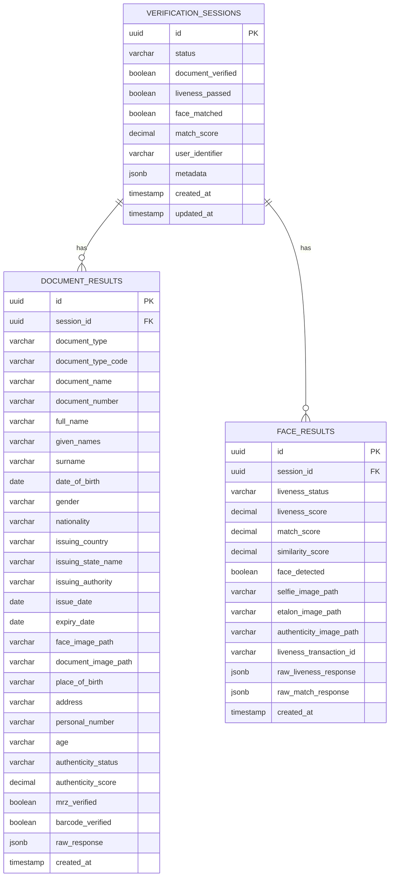
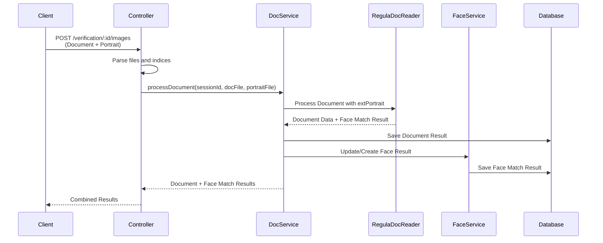
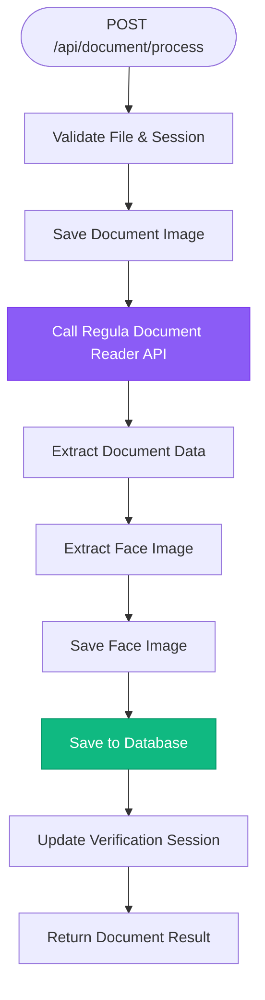
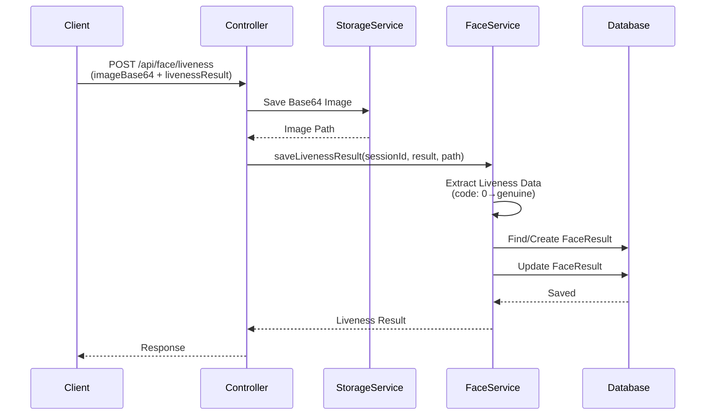
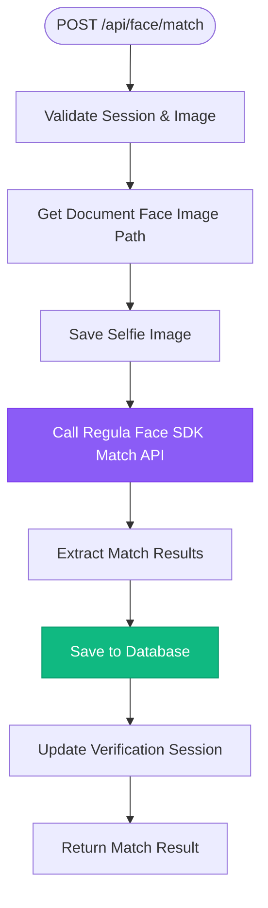
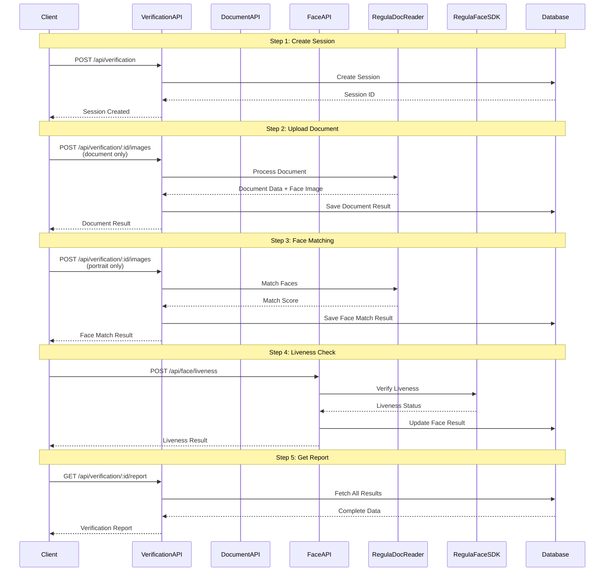
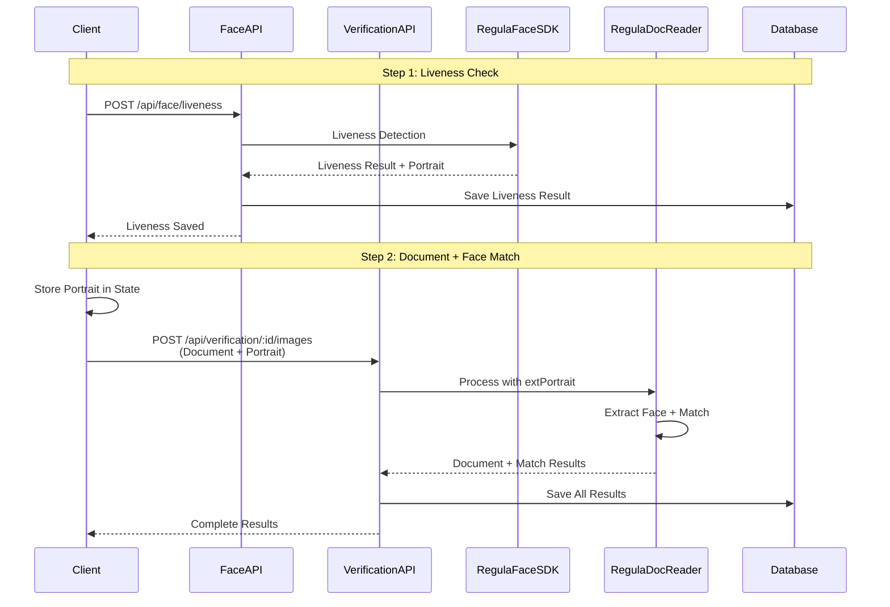
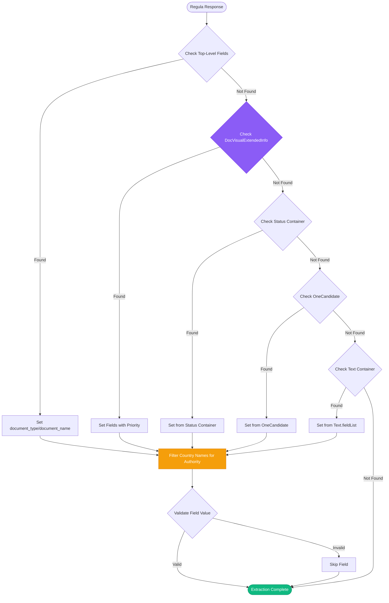

# Backend API Documentation

Complete documentation for the KYC Demo backend API, including database schemas, API endpoints, and process flows.

## 📋 Table of Contents

1. [Database Schema](#database-schema)
2. [API Endpoints](#api-endpoints)
3. [Process Flows](#process-flows)
4. [Document Field Extraction](#document-field-extraction)
5. [Data Models](#data-models)
6. [Error Handling](#error-handling)

---

## Database Schema

### Entity Relationship Diagram



### Tables Overview

#### 1. `verification_sessions`

Main table tracking verification sessions.

| Column | Type | Description | Constraints |
|--------|------|-------------|-------------|
| `id` | UUID | Primary key | NOT NULL, DEFAULT uuid_generate_v4() |
| `status` | VARCHAR(50) | Session status | NOT NULL, DEFAULT 'pending' |
| `document_verified` | BOOLEAN | Document verification status | DEFAULT FALSE |
| `liveness_passed` | BOOLEAN | Liveness check status | NULLABLE |
| `face_matched` | BOOLEAN | Face match status | DEFAULT FALSE |
| `match_score` | DECIMAL(5,2) | Face match score (0-100) | NULLABLE |
| `user_identifier` | VARCHAR(255) | User identifier | NULLABLE |
| `metadata` | JSONB | Additional metadata | NULLABLE |
| `created_at` | TIMESTAMP | Creation timestamp | NOT NULL, DEFAULT NOW() |
| `updated_at` | TIMESTAMP | Last update timestamp | NOT NULL, DEFAULT NOW() |

**Status Values:**
- `pending` - Session created, no processing yet
- `in_progress` - Processing in progress
- `completed` - All checks completed
- `failed` - Verification failed
- `expired` - Session expired

**Indexes:**
- `idx_verification_status` on `status`
- `idx_verification_created` on `created_at DESC`
- `idx_verification_user` on `user_identifier`

#### 2. `document_results`

Stores document verification results.

| Column | Type | Description | Constraints |
|--------|------|-------------|-------------|
| `id` | UUID | Primary key | NOT NULL |
| `session_id` | UUID | Foreign key to verification_sessions | NOT NULL |
| `document_type` | VARCHAR(100) | Type of document (passport, ID, etc.) | NULLABLE |
| `document_type_code` | VARCHAR(50) | Document type code (e.g., "P" for passport) | NULLABLE |
| `document_name` | VARCHAR(255) | Document name (e.g., "PASSPORT", "NATIONAL ID") | NULLABLE |
| `document_number` | VARCHAR(100) | Document number | NULLABLE |
| `full_name` | VARCHAR(255) | Full name from document | NULLABLE |
| `given_names` | VARCHAR(255) | Given names | NULLABLE |
| `surname` | VARCHAR(255) | Surname | NULLABLE |
| `date_of_birth` | DATE | Date of birth | NULLABLE |
| `gender` | VARCHAR(20) | Gender | NULLABLE |
| `nationality` | VARCHAR(255) | Nationality | NULLABLE |
| `issuing_country` | VARCHAR(255) | Country code that issued document (e.g., "PHL") | NULLABLE |
| `issuing_state_name` | VARCHAR(255) | Full country name (e.g., "Philippines") | NULLABLE |
| `issuing_authority` | VARCHAR(255) | Issuing authority name (e.g., "DFA LEGAZPI") | NULLABLE |
| `issue_date` | DATE | Document issue date | NULLABLE |
| `expiry_date` | DATE | Document expiry date | NULLABLE |
| `face_image_path` | VARCHAR(500) | Path to extracted face image | NULLABLE |
| `document_image_path` | VARCHAR(500) | Path to document image | NULLABLE |
| `place_of_birth` | VARCHAR(255) | Place of birth | NULLABLE |
| `address` | VARCHAR(255) | Address | NULLABLE |
| `personal_number` | VARCHAR(50) | Personal number | NULLABLE |
| `age` | VARCHAR(50) | Age | NULLABLE |
| `authenticity_status` | VARCHAR(50) | Authenticity status (genuine/fake/unknown) | NULLABLE |
| `authenticity_score` | DECIMAL(5,2) | Authenticity score (0-100) | NULLABLE |
| `mrz_verified` | BOOLEAN | MRZ verification status | NULLABLE |
| `barcode_verified` | BOOLEAN | Barcode verification status | NULLABLE |
| `raw_response` | JSONB | Raw Regula API response | NULLABLE |
| `created_at` | TIMESTAMP | Creation timestamp | NOT NULL, DEFAULT NOW() |

**Indexes:**
- `idx_document_session` on `session_id`

#### 3. `face_results`

Stores face verification and liveness results.

| Column | Type | Description | Constraints |
|--------|------|-------------|-------------|
| `id` | UUID | Primary key | NOT NULL |
| `session_id` | UUID | Foreign key to verification_sessions | NOT NULL |
| `liveness_status` | VARCHAR(50) | Liveness status (genuine/spoof/unknown) | NULLABLE |
| `liveness_score` | DECIMAL(5,2) | Liveness score (0-1) | NULLABLE |
| `liveness_confidence` | DECIMAL(5,2) | Liveness confidence (0-1) | NULLABLE |
| `match_status` | VARCHAR(50) | Face match status (matched/not_matched/unknown) | NULLABLE |
| `match_score` | DECIMAL(5,2) | Face match score (0-100) | NULLABLE |
| `similarity_score` | DECIMAL(5,2) | Similarity score (0-1) | NULLABLE |
| `face_quality_score` | DECIMAL(5,2) | Face quality score | NULLABLE |
| `face_detected` | BOOLEAN | Whether face was detected | NULLABLE |
| `face_count` | INT | Number of faces detected | NULLABLE |
| `selfie_image_path` | VARCHAR(500) | Path to selfie image | NULLABLE |
| `etalon_image_path` | VARCHAR(500) | Path to etalon image | NULLABLE |
| `authenticity_image_path` | VARCHAR(500) | Path to authenticity image | NULLABLE |
| `authenticity_percentage` | DECIMAL(5,2) | Authenticity percentage | NULLABLE |
| `liveness_transaction_id` | VARCHAR(255) | Regula transaction ID | NULLABLE |
| `liveness_tag` | VARCHAR(255) | Regula session tag | NULLABLE |
| `liveness_type` | INT | Liveness type (0=active, 1=passive) | NULLABLE |
| `liveness_estimated_age` | INT | Estimated age from liveness | NULLABLE |
| `liveness_code` | INT | Liveness result code (0=genuine) | NULLABLE |
| `liveness_metadata` | JSONB | Liveness metadata | NULLABLE |
| `liveness_images` | JSONB | Array of captured images | NULLABLE |
| `raw_liveness_response` | JSONB | Raw liveness API response | NULLABLE |
| `raw_match_response` | JSONB | Raw face match API response | NULLABLE |
| `created_at` | TIMESTAMP | Creation timestamp | NOT NULL, DEFAULT NOW() |

**Indexes:**
- `idx_face_session` on `session_id`

---

## API Endpoints

### Base URL

```
http://localhost:4000/api
```

### Health Check

#### `GET /health`

Check backend health status.

**Response:**
```json
{
  "status": "ok",
  "services": {
    "database": "connected",
    "documentReader": "available",
    "faceSDK": "available"
  },
  "timestamp": "2025-11-22T10:30:00Z"
}
```

---

### Verification Endpoints

#### `POST /api/verification`

Create a new verification session.

**Request Body:**
```json
{
  "user_identifier": "user-123",
  "metadata": {
    "source": "web",
    "ip_address": "192.168.1.1"
  }
}
```

**Response:**
```json
{
  "id": "550e8400-e29b-41d4-a716-446655440000",
  "status": "pending",
  "document_verified": false,
  "liveness_passed": null,
  "face_matched": false,
  "match_score": null,
  "user_identifier": "user-123",
  "metadata": {
    "source": "web",
    "ip_address": "192.168.1.1"
  },
  "created_at": "2025-11-22T10:30:00Z",
  "updated_at": "2025-11-22T10:30:00Z"
}
```

**Status Code:** `201 Created`

---

#### `GET /api/verification`

Get all verification sessions.

**Query Parameters:**
- `status` (optional) - Filter by status
- `limit` (optional) - Number of results (default: 100)
- `offset` (optional) - Pagination offset (default: 0)

**Response:**
```json
[
  {
    "id": "550e8400-e29b-41d4-a716-446655440000",
    "status": "completed",
    "document_verified": true,
    "liveness_passed": true,
    "face_matched": true,
    "match_score": 95.5,
    "created_at": "2025-11-22T10:30:00Z"
  }
]
```

---

#### `GET /api/verification/:id`

Get verification session by ID.

**Response:**
```json
{
  "id": "550e8400-e29b-41d4-a716-446655440000",
  "status": "completed",
  "document_verified": true,
  "liveness_passed": true,
  "face_matched": true,
  "match_score": 95.5,
  "user_identifier": "user-123",
  "metadata": {},
  "document_results": [
    {
      "id": "...",
      "document_type": "passport",
      "document_type_code": "P",
      "document_name": "PASSPORT",
      "full_name": "John Doe",
      "document_number": "AB123456",
      "nationality": "US",
      "issuing_country": "US",
      "issuing_state_name": "United States",
      "issuing_authority": "US DEPARTMENT OF STATE",
      "date_of_birth": "1990-01-01"
    }
  ],
  "face_results": [
    {
      "id": "...",
      "liveness_status": "genuine",
      "match_status": "matched",
      "match_score": 95.5
    }
  ],
  "created_at": "2025-11-22T10:30:00Z",
  "updated_at": "2025-11-22T10:35:00Z"
}
```

---

#### `GET /api/verification/:id/report`

Get comprehensive verification report.

**Response:**
```json
{
  "session_id": "550e8400-e29b-41d4-a716-446655440000",
  "verification_checks": {
    "document_verified": true,
    "liveness_passed": true,
    "face_matched": true
  },
  "document_data": {
    "document_type": "passport",
    "document_type_code": "P",
    "document_name": "PASSPORT",
    "document_number": "AB123456",
    "full_name": "John Doe",
    "given_names": "John",
    "surname": "Doe",
    "date_of_birth": "1990-01-01",
    "nationality": "US",
    "issuing_country": "US",
    "issuing_state_name": "United States",
    "issuing_authority": "US DEPARTMENT OF STATE",
    "issue_date": "2020-01-01",
    "expiry_date": "2030-01-01",
    "authenticity_status": "genuine",
    "authenticity_score": 100,
    "mrz_verified": true,
    "barcode_verified": true
  },
  "face_data": {
    "liveness_status": "genuine",
    "liveness_score": 1.0,
    "liveness_confidence": 0.95,
    "match_status": "matched",
    "match_score": 95.5,
    "similarity_score": 0.955
  },
  "overall_match_score": 95.5,
  "created_at": "2025-11-22T10:30:00Z",
  "completed_at": "2025-11-22T10:35:00Z"
}
```

---

#### `POST /api/verification/:id/images`

Upload images for verification (document and/or portrait).

**Request:**
- **Content-Type:** `multipart/form-data`
- **Files:** `images[]` - Array of image files (max 2)
- **Body Parameters:**
  - `documentIndex` (optional) - Index of document image (default: 0)
  - `faceIndex` (optional) - Index of portrait image (default: 1)

**Scenarios:**

1. **Document Only:**
   ```
   images[0] = document.jpg
   documentIndex = "0"
   ```

2. **Portrait Only (for face matching):**
   ```
   images[0] = portrait.jpg
   faceIndex = "0"
   (Document must already exist)
   ```

3. **Both Document and Portrait:**
   ```
   images[0] = document.jpg
   images[1] = portrait.jpg
   documentIndex = "0"
   faceIndex = "1"
   ```

**Response:**
```json
{
  "success": true,
  "session_id": "550e8400-e29b-41d4-a716-446655440000",
  "document_result": {
    "id": "...",
    "document_type": "passport",
    "full_name": "John Doe",
    "document_number": "AB123456",
    "authenticity_status": "genuine"
  },
  "face_match_result": {
    "id": "...",
    "match_status": "matched",
    "match_score": 95.5,
    "similarity_score": 0.955
  },
  "message": "Document and portrait processed successfully"
}
```

**Process Flow:**


---

#### `PATCH /api/verification/:id`

Update verification session.

**Request Body:**
```json
{
  "status": "completed",
  "user_identifier": "user-123"
}
```

**Response:**
```json
{
  "id": "550e8400-e29b-41d4-a716-446655440000",
  "status": "completed",
  "updated_at": "2025-11-22T10:35:00Z"
}
```

---

#### `DELETE /api/verification/:id`

Delete verification session (cascades to related results).

**Status Code:** `204 No Content`

---

### Document Endpoints

#### `POST /api/document/process`

Process document with Regula Document Reader.

**Request:**
- **Content-Type:** `multipart/form-data`
- **File:** `image` - Document image file
- **Body:** `sessionId` - Verification session ID

**Response:**
```json
{
  "success": true,
  "document_result": {
    "id": "...",
    "session_id": "550e8400-e29b-41d4-a716-446655440000",
    "document_type": "passport",
    "document_type_code": "P",
    "document_name": "PASSPORT",
    "document_number": "AB123456",
    "full_name": "John Doe",
    "given_names": "John",
    "surname": "Doe",
    "date_of_birth": "1990-01-01",
    "nationality": "US",
    "issuing_country": "US",
    "issuing_state_name": "United States",
    "issuing_authority": "US DEPARTMENT OF STATE",
    "issue_date": "2020-01-01",
    "expiry_date": "2030-01-01",
    "authenticity_status": "genuine",
    "authenticity_score": 100,
    "mrz_verified": true,
    "barcode_verified": true,
    "face_image_path": "/uploads/faces/.../face-from-document.jpg",
    "document_image_path": "/uploads/documents/.../document.jpg"
  }
}
```

**Process Flow:**


---

#### `GET /api/document/:sessionId`

Get document result by session ID.

**Response:**
```json
{
  "id": "...",
  "session_id": "550e8400-e29b-41d4-a716-446655440000",
  "document_type": "passport",
  "document_type_code": "P",
  "document_name": "PASSPORT",
  "document_number": "AB123456",
  "full_name": "John Doe",
  "given_names": "John",
  "surname": "Doe",
  "date_of_birth": "1990-01-01",
  "nationality": "US",
  "issuing_country": "US",
  "issuing_state_name": "United States",
  "issuing_authority": "US DEPARTMENT OF STATE",
  "issue_date": "2020-01-01",
  "expiry_date": "2030-01-01",
  "authenticity_status": "genuine",
  "authenticity_score": 100,
  "mrz_verified": true,
  "barcode_verified": true,
  "face_image_path": "/uploads/faces/.../face-from-document.jpg",
  "document_image_path": "/uploads/documents/.../document.jpg",
  "created_at": "2025-11-22T10:30:00Z"
}
```

---

#### `GET /api/document/:sessionId/face-image`

Get path to extracted face image from document.

**Response:**
```json
{
  "face_image_path": "/uploads/faces/550e8400-e29b-41d4-a716-446655440000/face-from-document.jpg"
}
```

---

### Face Endpoints

#### `POST /api/face/liveness`

Check face liveness.

**Request Body (JSON):**
```json
{
  "sessionId": "550e8400-e29b-41d4-a716-446655440000",
  "imageBase64": "data:image/jpeg;base64,/9j/4AAQSkZJRg...",
  "livenessResult": {
    "code": 0,
    "transactionId": "a9b418a8-5191-4ba9-a2fe-...",
    "tag": "d7001412-0555-4660-89ee-...",
    "status": 0,
    "estimatedAge": 28,
    "livenessType": "active"
  }
}
```

**OR Request (Multipart):**
- **File:** `file` - Image file
- **Body:** `sessionId` - Verification session ID

**Response:**
```json
{
  "success": true,
  "session_id": "550e8400-e29b-41d4-a716-446655440000",
  "liveness_result": {
    "liveness_status": "genuine",
    "liveness_score": 1.0,
    "liveness_confidence": 0.95,
    "liveness_code": 0,
    "liveness_transaction_id": "a9b418a8-5191-4ba9-a2fe-...",
    "liveness_tag": "d7001412-0555-4660-89ee-...",
    "liveness_type": 0,
    "liveness_estimated_age": 28
  }
}
```

**Process Flow:**


---

#### `POST /api/face/match`

Match selfie with document face.

**Request Body:**
```json
{
  "sessionId": "550e8400-e29b-41d4-a716-446655440000",
  "imageBase64": "data:image/jpeg;base64,/9j/4AAQSkZJRg..."
}
```

**OR Request (Multipart):**
- **Files:** `files[]` - Array of image files
- **Body:** `sessionId` - Verification session ID

**Response:**
```json
{
  "success": true,
  "session_id": "550e8400-e29b-41d4-a716-446655440000",
  "match_result": {
    "match_status": "matched",
    "match_score": 95.5,
    "similarity_score": 0.955,
    "face_detected": true
  }
}
```

**Process Flow:**


---

#### `GET /api/face/:sessionId`

Get face result by session ID.

**Response:**
```json
{
  "id": "...",
  "session_id": "550e8400-e29b-41d4-a716-446655440000",
  "liveness_status": "genuine",
  "liveness_score": 1.0,
  "match_status": "matched",
  "match_score": 95.5,
  "similarity_score": 0.955,
  "selfie_image_path": "/uploads/faces/.../selfie.jpg",
  "created_at": "2025-11-22T10:30:00Z"
}
```

---

## Process Flows

### Complete Verification Flow (Full Scenario)



### Liveness-First Flow



---

## Document Field Extraction

The backend extracts document fields from the Regula Document Reader API response using a multi-source approach with priority-based fallback. This ensures maximum data extraction accuracy across different document types and Regula API response structures.

### Extraction Strategy

The extraction process follows a priority order, checking multiple locations in the Regula response:

1. **Top-level fields** - Direct properties on the response object
2. **DocVisualExtendedInfo.pArrayFields** - Visual field extraction (highest priority for certain fields)
3. **Status container** (result_type 33) - Document status and metadata
4. **OneCandidate container** (result_type 9) - Document candidate information
5. **Text container** (result_type 36/37) - OCR text extraction

### Key Fields Extraction

#### Document Name and Document Type

These fields are extracted from multiple sources in priority order:

**Extraction Locations:**
1. Top-level: `dDescription`, `DDescription`, `DocumentName`, `documentName`
2. Status container: `Status.dDescription`, `Status.DocumentName`
3. OneCandidate container: `OneCandidate.dDescription`, `OneCandidate.DocumentName`
4. DocVisualExtendedInfo: Fields with `fieldName === 'Document Name'` or `fieldName === 'Document Type'`

**Example:**
```typescript
// Priority 1: Top-level
if (regulaResponse?.dDescription) {
  result.document_type = regulaResponse.dDescription;
}

// Priority 2: Status container
if (statusContainer?.dDescription && !result.document_type) {
  result.document_type = statusContainer.dDescription;
}

// Priority 3: OneCandidate (fallback)
if (oneCandidate?.dDescription && !result.document_type) {
  result.document_type = oneCandidate.dDescription;
}
```

#### Issuing Authority

The `issuing_authority` field requires special handling to distinguish between country names and actual authority names (e.g., "DFA LEGAZPI" vs "Philippines").

**Extraction Logic:**
1. **Primary Source:** `DocVisualExtendedInfo.pArrayFields` with:
   - `fieldType === 24` OR
   - `fieldName === 'Authority'` OR
   - `fieldName === 'Issuing Authority'`

2. **Secondary Source:** `Text.fieldList` with:
   - `fieldType === 24` OR
   - `fieldName === 'Authority'` OR
   - `fieldName === 'Issuing Authority'`

3. **Filtering:** Country names are filtered out to prevent incorrect extraction:
   ```typescript
   const countryNames = ['Philippines', 'PHL', 'United States', 'USA', 'Canada', 'Australia'];
   if (!countryNames.includes(trimmedValue) && trimmedValue.length > 3) {
     result.issuing_authority = trimmedValue;
   }
   ```

**Field Type Reference:**
- `fieldType: 24` - Authority/Issuing Authority
- `fieldType: 38` - Issuing State Name (country name)
- `fieldType: 1` - Issuing State Code (country code like "PHL")

#### Other Document Fields

Standard fields are extracted using Regula field types:

| Field | Field Type | Description |
|-------|------------|-------------|
| `document_number` | 2 | Document number |
| `surname` | 8 | Last name |
| `given_names` | 9 | First/middle names |
| `date_of_birth` | 5 | Date of birth |
| `date_of_expiry` | 3 | Expiry date |
| `date_of_issue` | 4 | Issue date |
| `nationality` | 11 | Nationality code |
| `gender` | 12 | Gender (M/F) |
| `place_of_birth` | 6 | Place of birth |
| `issuing_country` | 1 | Issuing state code (e.g., "PHL") |
| `issuing_state_name` | 38 | Full country name (e.g., "Philippines") |
| `issuing_authority` | 24 | Authority name (e.g., "DFA LEGAZPI") |
| `personal_number` | 29 | Personal identification number |
| `address` | 30 | Address field |

### Value Source Priority

When multiple values are available (e.g., in `valueList`), the extraction prioritizes:

1. **VISUAL source** - Values extracted from visual OCR (most accurate)
2. **First available value** - Fallback if VISUAL not available

```typescript
// Prefer VISUAL source
const visualValue = field.valueList.find((v: any) => v.source === 'VISUAL')?.value;
if (visualValue) {
  value = visualValue;
} else {
  value = field.valueList[0].value;
}
```

### Extraction Flow Diagram



### Common Issues and Solutions

#### Issue: `issuing_authority` shows country name instead of authority

**Cause:** Country name being extracted from wrong field type.

**Solution:** The extraction now:
- Filters out known country names
- Checks `fieldName` in addition to `fieldType`
- Prioritizes `DocVisualExtendedInfo` over `Text` container

#### Issue: `document_name` or `document_type` missing

**Cause:** Field not present in expected location.

**Solution:** Extraction now checks:
1. Top-level response
2. Status container
3. OneCandidate container (new)
4. DocVisualExtendedInfo fields

#### Issue: Fields extracted from wrong source

**Cause:** Multiple sources with different values.

**Solution:** Priority system ensures:
- `DocVisualExtendedInfo` takes precedence for visual fields
- VISUAL source values preferred over other sources
- Country name filtering prevents incorrect authority extraction

---

## Data Models

### VerificationSession

```typescript
interface VerificationSession {
  id: string;                    // UUID
  status: string;                // 'pending' | 'in_progress' | 'completed' | 'failed' | 'expired'
  document_verified: boolean;
  liveness_passed: boolean | null;
  face_matched: boolean;
  match_score: number | null;    // 0-100
  user_identifier: string | null;
  metadata: Record<string, any> | null;
  created_at: Date;
  updated_at: Date;
  document_results?: DocumentResult[];
  face_results?: FaceResult[];
}
```

### DocumentResult

```typescript
interface DocumentResult {
  id: string;                    // UUID
  session_id: string;            // UUID (FK)
  document_type: string | null;  // Document type (e.g., "passport", "ID card")
  document_type_code: string | null;  // Document type code (e.g., "P" for passport)
  document_name: string | null;  // Document name (e.g., "PASSPORT", "NATIONAL ID")
  document_number: string | null;
  full_name: string | null;
  given_names: string | null;
  surname: string | null;
  date_of_birth: Date | null;
  gender: string | null;
  nationality: string | null;
  issuing_country: string | null;  // Country code (e.g., "PHL")
  issuing_state_name: string | null;  // Full country name (e.g., "Philippines")
  issuing_authority: string | null;  // Authority name (e.g., "DFA LEGAZPI")
  issue_date: Date | null;
  expiry_date: Date | null;
  face_image_path: string | null;
  document_image_path: string | null;
  place_of_birth: string | null;
  address: string | null;
  personal_number: string | null;
  age: string | null;
  authenticity_status: string | null;  // 'genuine' | 'fake' | 'unknown'
  authenticity_score: number | null;    // 0-100
  mrz_verified: boolean | null;
  barcode_verified: boolean | null;
  raw_response: Record<string, any> | null;
  created_at: Date;
}
```

### FaceResult

```typescript
interface FaceResult {
  id: string;                    // UUID
  session_id: string;            // UUID (FK)
  liveness_status: string | null;      // 'genuine' | 'spoof' | 'unknown'
  liveness_score: number | null;       // 0-1
  liveness_confidence: number | null;   // 0-1
  match_status: string | null;          // 'matched' | 'not_matched' | 'unknown'
  match_score: number | null;           // 0-100
  similarity_score: number | null;      // 0-1
  face_quality_score: number | null;
  face_detected: boolean | null;
  face_count: number | null;
  selfie_image_path: string | null;
  etalon_image_path: string | null;
  authenticity_image_path: string | null;
  authenticity_percentage: number | null;
  liveness_transaction_id: string | null;
  liveness_tag: string | null;
  liveness_type: number | null;        // 0 = active, 1 = passive
  liveness_estimated_age: number | null;
  liveness_code: number | null;        // 0 = genuine
  liveness_metadata: Record<string, any> | null;
  liveness_images: string[] | null;
  raw_liveness_response: Record<string, any> | null;
  raw_match_response: Record<string, any> | null;
  created_at: Date;
}
```

---

## Error Handling

### Error Response Format

```json
{
  "statusCode": 400,
  "message": "Error message here",
  "error": "Bad Request"
}
```

### Common Error Codes

| Status Code | Meaning | Common Causes |
|-------------|---------|---------------|
| `400` | Bad Request | Missing required fields, invalid data |
| `404` | Not Found | Session or resource not found |
| `500` | Internal Server Error | Server-side error, Regula API failure |

### Error Examples

**Missing Session ID:**
```json
{
  "statusCode": 400,
  "message": "Session ID is required",
  "error": "Bad Request"
}
```

**Session Not Found:**
```json
{
  "statusCode": 400,
  "message": "No verification session found with id: 550e8400-...",
  "error": "Bad Request"
}
```

**No Image Provided:**
```json
{
  "statusCode": 400,
  "message": "No images provided",
  "error": "Bad Request"
}
```

---

## File Storage Structure

```
uploads/
├── documents/
│   └── {session_id}/
│       └── document.jpg
├── faces/
│   └── {session_id}/
│       ├── liveness.jpg
│       ├── selfie.jpg
│       ├── face-from-document.jpg
│       └── authenticity/
│           ├── etalon.jpg
│           └── authenticity.jpg
└── ...
```

---

## Related Documentation

- [Frontend Documentation](../frontend/README.md)
- [Installation Guide](../INSTALLATION.md)
- [Verification Scenarios](../VERIFICATION_SCENARIOS_COMPARISON.md)
- [Liveness Guide](../LIVENESS_GUIDE.md)

---

**Last Updated:** November 22, 2025  
**API Version:** 1.0  
**Status:** ✅ Production Ready

