# Frontend Documentation

Complete documentation for the KYC Demo frontend application, including component architecture, state management, routing, and user flows.

## 📋 Table of Contents

1. [Architecture Overview](#architecture-overview)
2. [Project Structure](#project-structure)
3. [Component Architecture](#component-architecture)
4. [State Management](#state-management)
5. [Routing](#routing)
6. [API Integration](#api-integration)
7. [User Flows](#user-flows)
8. [Type Definitions](#type-definitions)
9. [Styling System](#styling-system)

---

## Architecture Overview

### Technology Stack

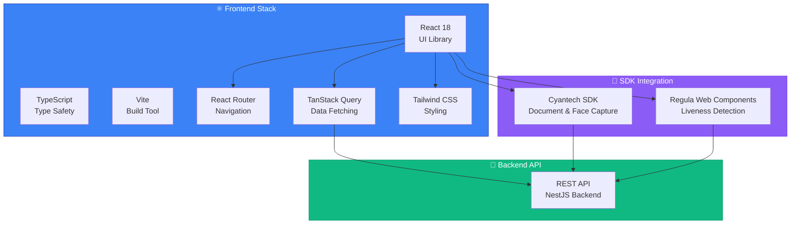

### Application Architecture

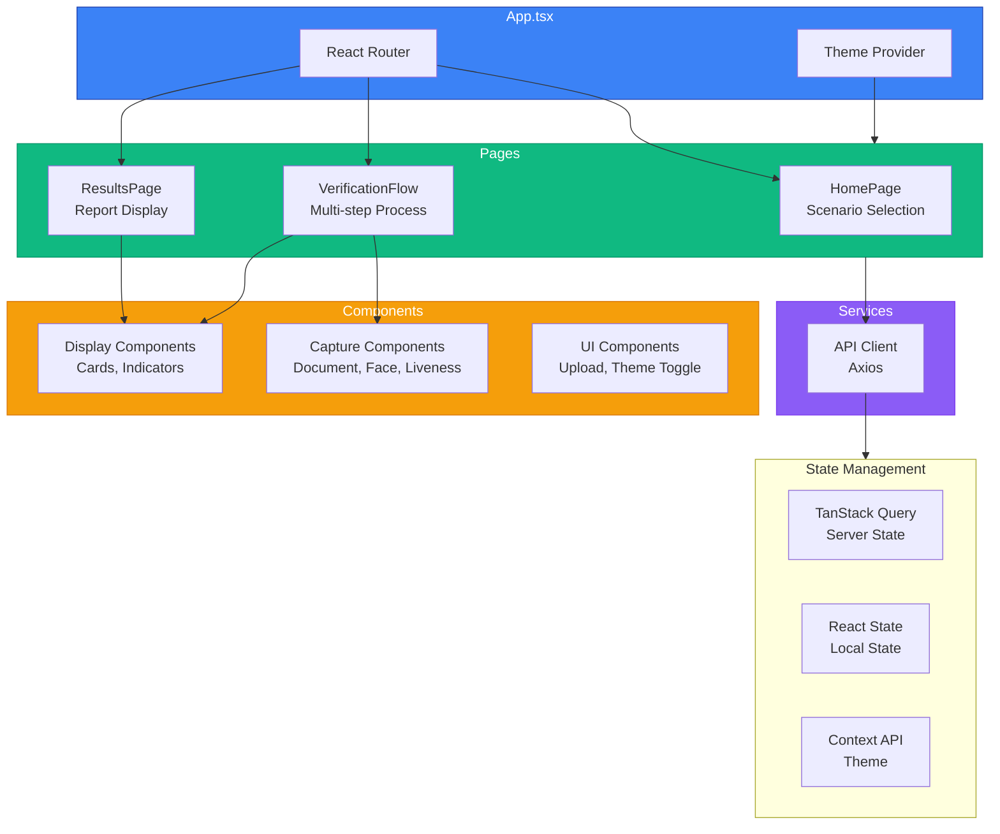

---

## Project Structure

```
frontend/
├── src/
│   ├── pages/                    # Page components
│   │   ├── HomePage.tsx          # Landing page with scenario selection
│   │   ├── VerificationFlow.tsx  # Main verification flow (multi-step)
│   │   └── ResultsPage.tsx       # Results display page
│   │
│   ├── components/               # Reusable components
│   │   ├── CyantechDocumentCapture.tsx    # Document capture (SDK)
│   │   ├── CyantechFaceCapture.tsx        # Face capture with liveness (SDK)
│   │   ├── CyantechPortraitCapture.tsx    # Portrait capture (SDK)
│   │   ├── CameraCapture.tsx             # Generic webcam component
│   │   ├── UploadZone.tsx                 # File upload component
│   │   ├── DocumentResultCard.tsx         # Document results display
│   │   ├── FaceMatchCard.tsx              # Face match results display
│   │   ├── LivenessCard.tsx               # Liveness results display
│   │   ├── ImageMagnifier.tsx             # Image zoom component
│   │   ├── StepIndicator.tsx              # Progress indicator
│   │   └── ThemeToggle.tsx                # Dark/light theme toggle
│   │
│   ├── services/                 # API and external services
│   │   └── api.ts                # Axios client and API functions
│   │
│   ├── types/                    # TypeScript type definitions
│   │   ├── index.ts              # Main type definitions
│   │   └── cyantech.d.ts         # Cyantech SDK type definitions
│   │
│   ├── contexts/                 # React Context providers
│   │   └── ThemeContext.tsx      # Theme management context
│   │
│   ├── hooks/                    # Custom React hooks (if any)
│   │
│   ├── assets/                   # Static assets
│   │
│   ├── App.tsx                   # Root component with routing
│   ├── App.css                   # Global app styles
│   ├── main.tsx                  # Application entry point
│   └── index.css                 # Global styles and Tailwind imports
│
├── public/                       # Static public files
├── index.html                    # HTML template
├── vite.config.ts                # Vite configuration
├── tailwind.config.js           # Tailwind CSS configuration
├── tsconfig.json                 # TypeScript configuration
└── package.json                  # Dependencies and scripts
```

---

## Component Architecture

### Component Hierarchy

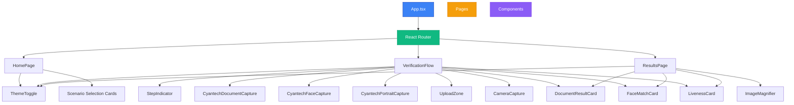

### Component Details

#### Page Components

##### 1. `HomePage.tsx`

**Purpose:** Landing page with verification scenario selection

**Features:**
- Scenario selection (Full, Standard, Liveness-First)
- Session creation
- Navigation to verification flow

**State:**
```typescript
const [loading, setLoading] = useState(false);
const [error, setError] = useState<string | null>(null);
const [selectedScenario, setSelectedScenario] = useState<VerificationScenario | null>(null);
```

**Key Functions:**
- `handleStartVerification(scenario)` - Creates session and navigates

**Props:** None (uses React Router hooks)

---

##### 2. `VerificationFlow.tsx`

**Purpose:** Multi-step verification process

**Features:**
- Step management (document-upload, face-match, liveness-check)
- File upload and camera capture
- Real-time status updates
- Scenario-based flow control

**State:**
```typescript
const [currentStep, setCurrentStep] = useState<VerificationStep>('document-upload');
const [error, setError] = useState<string | null>(null);
const [documentResult, setDocumentResult] = useState<any>(null);
const [faceMatchResult, setFaceMatchResult] = useState<any>(null);
const [livenessResult, setLivenessResult] = useState<any>(null);
const [livenessImageData, setLivenessImageData] = useState<string | null>(null);
const [documentPreview, setDocumentPreview] = useState<string | null>(null);
const [facePreview, setFacePreview] = useState<string | null>(null);
const [showDocumentCamera, setShowDocumentCamera] = useState(false);
const [showFaceCamera, setShowFaceCamera] = useState(false);
```

**Mutations (TanStack Query):**
- `documentMutation` - Document upload
- `faceMutation` - Face matching
- `livenessMutation` - Liveness check

**Queries (TanStack Query):**
- `useQuery(['verification', sessionId])` - Session status

**Flow Logic:**
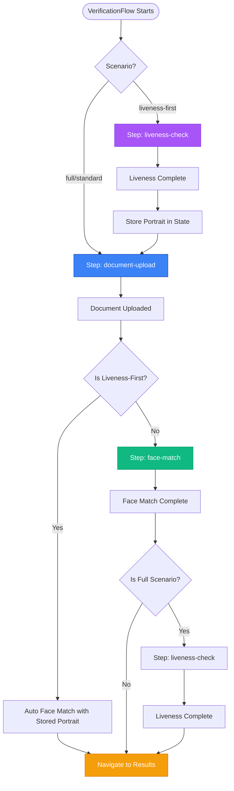

---

##### 3. `ResultsPage.tsx`

**Purpose:** Display comprehensive verification results

**Features:**
- Complete verification report
- Document data display
- Face match results
- Liveness results
- Image display with magnifier

**Queries:**
```typescript
const { data: report, isLoading, error } = useQuery({
  queryKey: ['report', sessionId],
  queryFn: () => getVerificationReport(sessionId!),
  enabled: !!sessionId,
  retry: 1,
});
```

**Components Used:**
- `DocumentResultCard` - Document information
- `FaceMatchCard` - Face matching results
- `LivenessCard` - Liveness detection results
- `ImageMagnifier` - Zoomable images

---

#### Reusable Components

##### Capture Components

**1. `CyantechDocumentCapture.tsx`**
- Integrates Cyantech Document SDK
- Auto-detection and quality checks
- Returns captured document images

**Props:**
```typescript
interface CyantechDocumentCaptureProps {
  onCapture: (images: string[]) => void;
  onClose?: () => void;
}
```

**2. `CyantechFaceCapture.tsx`**
- Integrates Cyantech Face SDK with liveness
- Built-in liveness detection
- Returns face image + liveness result

**Props:**
```typescript
interface CyantechFaceCaptureProps {
  onCapture: (image: string, livenessResult?: any) => void;
  onClose?: () => void;
}
```

**3. `CyantechPortraitCapture.tsx`**
- Portrait capture without liveness
- Used for face matching step

**4. `CameraCapture.tsx`**
- Generic webcam component
- Fallback for browsers without SDK support

---

##### Display Components

**1. `DocumentResultCard.tsx`**
- Displays extracted document data
- Shows authenticity status
- Document image preview

**2. `FaceMatchCard.tsx`**
- Displays face match results
- Shows both document and selfie photos
- Match score and status

**3. `LivenessCard.tsx`**
- Displays liveness detection results
- Shows liveness status and score
- Liveness image preview

**4. `ImageMagnifier.tsx`**
- Zoomable image component
- Hover to magnify
- Used for document and face images

**5. `StepIndicator.tsx`**
- Progress indicator
- Shows current step and total steps
- Visual progress bar

---

##### UI Components

**1. `UploadZone.tsx`**
- Drag-and-drop file upload
- File validation
- Preview support

**Props:**
```typescript
interface UploadZoneProps {
  onFileSelect: (file: File) => void;
  accept?: string;        // Default: 'image/*'
  maxSize?: number;        // Default: 10MB
}
```

**2. `ThemeToggle.tsx`**
- Dark/light theme toggle
- Uses ThemeContext
- Persists preference in localStorage

---

## State Management

### State Management Architecture

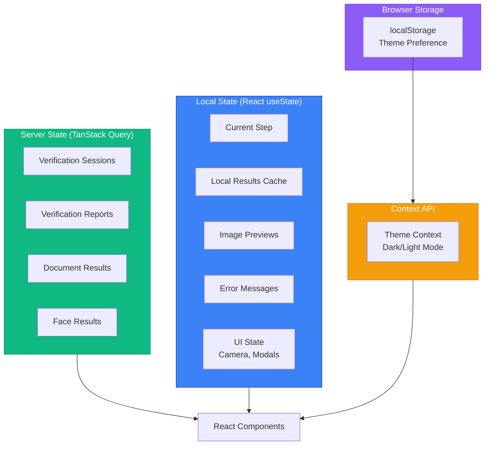

### TanStack Query Configuration

```typescript
const queryClient = new QueryClient({
  defaultOptions: {
    queries: {
      refetchOnWindowFocus: false,
      retry: 1,
    },
  },
});
```

### Query Keys

```typescript
// Verification session
['verification', sessionId]

// Verification report
['report', sessionId]

// Document result
['document', sessionId]

// Face result
['face', sessionId]
```

### Mutations

```typescript
// Document upload
documentMutation = useMutation({
  mutationFn: async (file: File) => {
    // Upload document
  },
  onSuccess: (data) => {
    // Handle success
  },
  onError: (err) => {
    // Handle error
  },
});
```

---

## Routing

### Route Structure

```mermaid
graph LR
    App[App.tsx] --> Router[React Router]
    Router --> Route1[/ - HomePage]
    Router --> Route2[/verify/:sessionId - VerificationFlow]
    Router --> Route3[/results/:sessionId - ResultsPage]
    
    style Router fill:#3b82f6,stroke:#1e40af,color:#fff
    style Route1 fill:#10b981,stroke:#059669,color:#fff
    style Route2 fill:#f59e0b,stroke:#d97706,color:#fff
    style Route3 fill:#8b5cf6,stroke:#7c3aed,color:#fff
```

### Route Definitions

```typescript
<Routes>
  <Route path="/" element={<HomePage />} />
  <Route path="/verify/:sessionId" element={<VerificationFlow />} />
  <Route path="/results/:sessionId" element={<ResultsPage />} />
</Routes>
```

### Navigation Flow

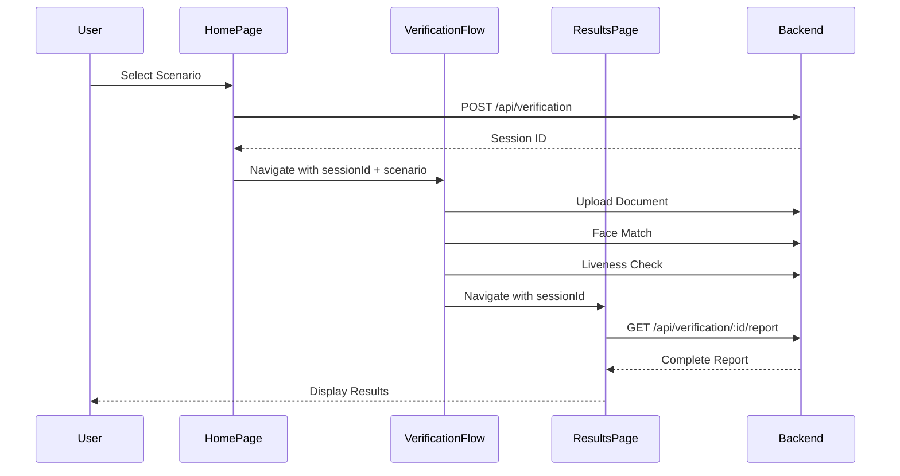

---

## API Integration

### API Client Setup

```typescript
// services/api.ts
const api = axios.create({
  baseURL: `${API_URL}/api`,
  headers: {
    'Content-Type': 'application/json',
  },
  timeout: 60000, // 60 seconds
});
```

### API Functions

#### Verification APIs

```typescript
// Create session
createVerificationSession(userIdentifier?: string): Promise<VerificationSession>

// Get session
getVerificationSession(sessionId: string): Promise<VerificationSession>

// Get report
getVerificationReport(sessionId: string): Promise<VerificationReport>

// Get all verifications
getAllVerifications(): Promise<VerificationSession[]>

// Get statistics
getVerificationStatistics(): Promise<any>
```

#### Document APIs

```typescript
// Process document
processDocument(sessionId: string, file: File): Promise<DocumentProcessResponse>

// Get document result
getDocumentResult(sessionId: string): Promise<DocumentResult>
```

#### Face APIs

```typescript
// Check liveness (with base64)
checkLivenessFromBase64(
  sessionId: string,
  imageBase64: string,
  livenessResult?: any
): Promise<LivenessCheckResponse>

// Match faces (with base64)
matchFacesWithBase64(
  sessionId: string,
  base64Image: string
): Promise<FaceMatchResponse>

// Upload verification images (document + portrait)
uploadVerificationImages(
  sessionId: string,
  documentFile: File,
  faceFile: File
): Promise<any>
```

### API Call Flow

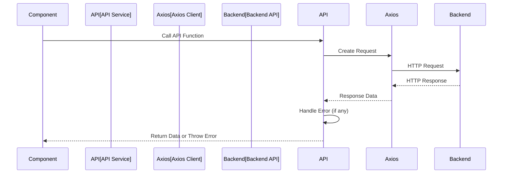

---

## User Flows

### Full Verification Flow

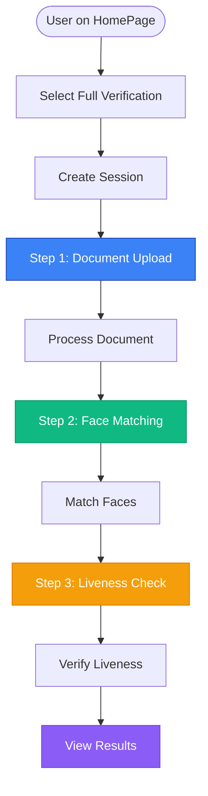

### Liveness-First Flow

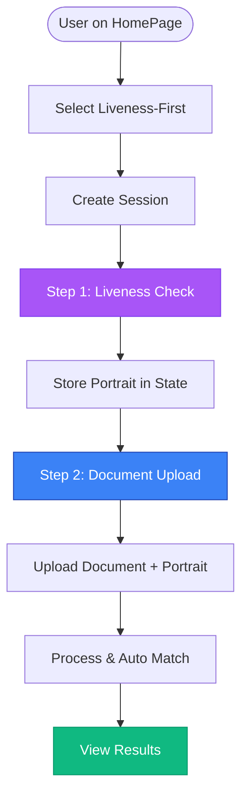

### Standard Verification Flow

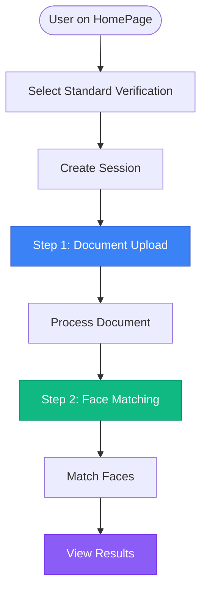

---

## Type Definitions

### Core Types

```typescript
// Verification Session
interface VerificationSession {
  id: string;
  status: 'pending' | 'in_progress' | 'completed' | 'failed' | 'expired';
  document_verified: boolean;
  liveness_passed: boolean;
  face_matched: boolean;
  match_score: number | null;
  user_identifier?: string;
  metadata?: any;
  created_at: string;
  updated_at: string;
}

// Verification Step
type VerificationStep = 
  | 'document-upload'
  | 'liveness-check'
  | 'face-match'
  | 'results';

// Verification Scenario
type VerificationScenario = 
  | 'full'           // Document + Face Match + Liveness
  | 'standard'       // Document + Face Match
  | 'liveness-first'; // Liveness + Document (auto match)
```

### Component Props Types

```typescript
// Upload Zone
interface UploadZoneProps {
  onFileSelect: (file: File) => void;
  accept?: string;        // Default: 'image/*'
  maxSize?: number;       // Default: 10MB
}

// Camera Capture
interface CameraCaptureProps {
  onCapture: (imageData: string) => void;
  onError?: (error: Error) => void;
}

// Step Indicator
interface StepIndicatorProps {
  currentStep: number;
  steps: string[];
}
```

---

## Styling System

### Tailwind CSS Configuration

The app uses Tailwind CSS with custom configuration:

```javascript
// tailwind.config.js
module.exports = {
  darkMode: 'class',
  content: ['./index.html', './src/**/*.{js,ts,jsx,tsx}'],
  theme: {
    extend: {
      // Custom colors, spacing, etc.
    },
  },
  plugins: [],
};
```

### Theme System

**Dark Mode:**
- Uses `dark:` prefix for dark mode styles
- Controlled by `ThemeContext`
- Persisted in `localStorage`
- Respects system preference on first load

**Theme Toggle:**
```typescript
const { theme, toggleTheme } = useTheme();
```

### Common Utility Classes

```css
/* Buttons */
.btn, .btn-primary, .btn-secondary

/* Cards */
.card

/* Status Badges */
.status-badge, .status-success, .status-error

/* Loading */
.loading-spinner

/* Upload Zone */
.upload-zone
```

### Color Scheme

```mermaid
graph LR
    subgraph Light["Light Theme"]
        L1[Background: white/blue-50]
        L2[Text: gray-900]
        L3[Primary: blue-600]
        L4[Success: green-600]
    end
    
    subgraph Dark["Dark Theme"]
        D1[Background: gray-900]
        D2[Text: gray-100]
        D3[Primary: blue-400]
        D4[Success: green-400]
    end
    
    style Light fill:#f3f4f6,stroke:#9ca3af
    style Dark fill:#1f2937,stroke:#4b5563
```

---

## Error Handling

### Error Handling Strategy

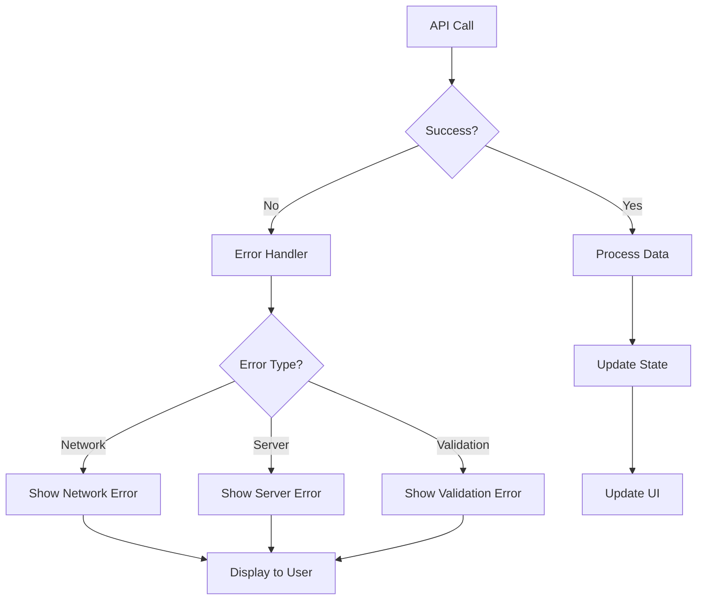

### Error Display

```typescript
// Error state
const [error, setError] = useState<string | null>(null);

// Error display
{error && (
  <div className="error-message">
    {error}
  </div>
)}
```

---

## Browser Compatibility

### Supported Browsers

- Chrome 90+
- Firefox 88+
- Safari 14+
- Edge 90+

### Camera Requirements

- HTTPS required in production
- Browser permissions needed
- WebRTC support required

### Feature Detection

```typescript
// Check camera support
const hasCamera = navigator.mediaDevices && 
                  navigator.mediaDevices.getUserMedia;

// Check file upload support
const hasFileUpload = 'FileReader' in window;
```

---

## Performance Optimization

### Code Splitting

- Route-based code splitting (React Router)
- Lazy loading for heavy components

### Image Optimization

- Base64 encoding for small images
- File upload for larger images
- Image preview before upload

### Query Optimization

- TanStack Query caching
- Stale-while-revalidate pattern
- Optimistic updates where appropriate

---

## Related Documentation

- [Backend API Documentation](./BACKEND_API_DOCUMENTATION.md) - Complete backend API reference
- [Verification Scenarios](./VERIFICATION_SCENARIOS_COMPARISON.md) - Verification flow comparison
- [Installation Guide](./INSTALLATION.md) - Setup instructions

---

**Last Updated:** November 22, 2025  
**Frontend Version:** 1.0  
**Status:** ✅ Production Ready

