# Regula SDK Complete Guide

Complete guide for Regula Document Reader SDK and Face SDK integration, setup, configuration, and usage in the KYC Demo application.

## 📋 Table of Contents

1. [Overview](#overview)
2. [Architecture](#architecture)
3. [Installation & Setup](#installation--setup)
4. [Frontend Integration](#frontend-integration)
5. [Liveness Detection](#liveness-detection)
6. [Liveness-First Verification](#liveness-first-verification)
7. [Understanding Spoof Detection](#understanding-spoof-detection)
8. [Architecture Decisions](#architecture-decisions)
9. [Troubleshooting](#troubleshooting)
10. [API Reference](#api-reference)

---

## Overview

### What We Use

| Component | Purpose | Features |
|-----------|---------|----------|
| **Regula Face SDK Web Components** | Face capture & liveness | ✅ Built-in liveness detection<br>✅ Face positioning guidance<br>✅ Quality checks<br>✅ Professional UI |
| **Regula Document Reader Web Components** | Document capture | ✅ Auto-detection<br>✅ Quality assessment<br>✅ Edge detection<br>✅ Glare detection |
| **Regula Face SDK Web Service** | Backend processing | ✅ Face comparison<br>✅ Liveness verification<br>✅ Face identification |
| **Regula Document Reader Web Service** | Backend processing | ✅ Document validation<br>✅ Data extraction<br>✅ Authenticity checks |

### Key Benefits

✅ **Built-in Liveness Detection** - No separate liveness step needed  
✅ **Professional UI** - Consistent, tested user experience  
✅ **Quality Assurance** - Automatic quality checks and real-time feedback  
✅ **Production-Ready** - Battle-tested components from Regula  
✅ **Mobile Friendly** - Responsive and touch-optimized  
✅ **Secure** - Industry-standard biometric security  

---

## Architecture

### Complete System Architecture

```mermaid
graph TB
    subgraph Frontend["⚛️ Frontend (React)"]
        DocComp[RegulaDocumentCapture<br/>Web Component<br/>- Auto-detection<br/>- Quality checks<br/>- Edge detection]
        FaceComp[RegulaFaceCapture<br/>Web Component<br/>- Built-in liveness<br/>- Face positioning<br/>- Quality checks]
    end
    
    subgraph Backend["🔧 Backend API (NestJS)"]
        DocAPI[/api/document/process]
        FaceAPI[/api/face/liveness]
        MatchAPI[/api/face/match]
    end
    
    subgraph Services["🔌 Regula Services (Docker)"]
        DocService[Document Reader<br/>Web Service<br/>Port: 8080<br/>- Document validation<br/>- Data extraction<br/>- Face extraction]
        FaceService[Face SDK Service<br/>Port: 8081<br/>- Liveness detection<br/>- Face matching]
    end
    
    subgraph Database["💾 Database"]
        PG[(PostgreSQL<br/>Port: 5432)]
    end
    
    DocComp -->|HTTP| DocAPI
    FaceComp -->|HTTP| FaceAPI
    FaceComp -->|HTTP| MatchAPI
    DocAPI -->|HTTP| DocService
    FaceAPI -->|HTTP| FaceService
    MatchAPI -->|HTTP| FaceService
    Backend -->|TypeORM| PG
    
    style Frontend fill:#3b82f6,stroke:#1e40af,color:#fff
    style Backend fill:#10b981,stroke:#059669,color:#fff
    style Services fill:#8b5cf6,stroke:#7c3aed,color:#fff
    style Database fill:#f59e0b,stroke:#d97706,color:#fff
```

### Integration Flow

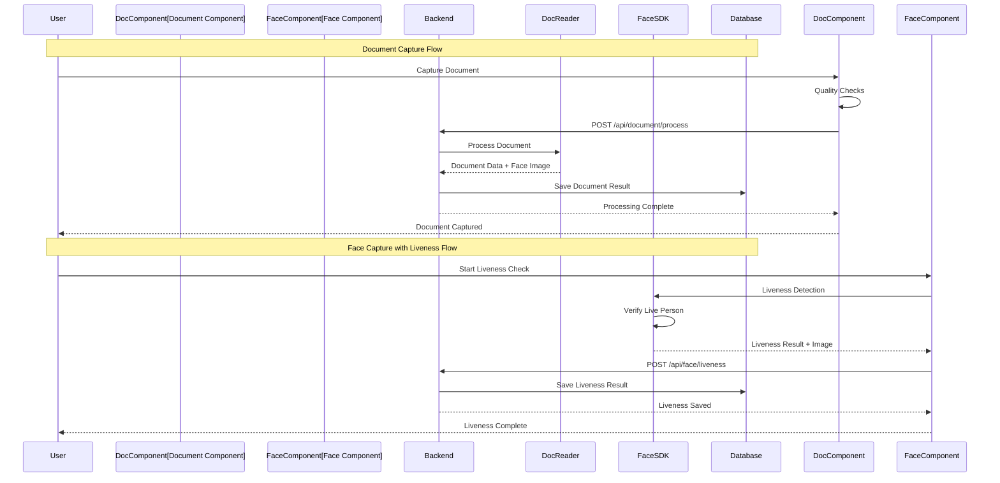

---

## Installation & Setup

### Prerequisites

- ✅ Docker Desktop (v24.0+)
- ✅ Node.js (v18.0+)
- ✅ PostgreSQL (v14.0+) - locally installed
- ✅ Regula License Files:
  - `regula-licenses/docreader.license`
  - `regula-licenses/facesdk.license`

### Step 1: Download Document Reader SDK

**Windows:**
```powershell
.\download-docreader.ps1
```

**Linux / macOS / WSL:**
```bash
chmod +x download-docreader.sh
./download-docreader.sh
```

**Download Size:** ~50-100MB  
**Time:** 2-5 minutes

### Step 2: Download Face SDK Package

```bash
bash download-facesdk.sh
```

**What it does:**
- Shows all available Face SDK versions
- Lets you select (or press Enter for latest)
- Downloads with progress bar and ETA
- Saves to: `docker/facesdk/face-rec-service-cpu_*.deb`

**Download Size:** ~1.1GB  
**Download Time:** 5-15 minutes

### Step 3: Install Frontend Dependencies

```bash
cd frontend
npm install
```

This installs Regula SDK Web Components:
- `@regulaforensics/vp-frontend-face-components` (^7.2.0)
- `@regulaforensics/vp-frontend-document-components` (^8.4.0)

### Step 4: Build Docker Images

```bash
# Build all services
docker-compose build

# Or build individually
docker-compose build regula-docreader
docker-compose build regula-face
docker-compose build backend frontend
```

### Step 5: Start Services

```bash
# Start all services
docker-compose up -d

# Or start in order (if dependencies matter)
docker-compose up -d postgres storage
sleep 10
docker-compose up -d regula-face
docker-compose up -d backend frontend
```

### Step 6: Verify Installation

```bash
# Test Document Reader
curl http://127.0.0.1:8080/api/ping
# Expected: {"code":0}

# Test Face SDK
curl http://localhost:8081/api/ping
# Expected: {"status":"ok"}

# Test Backend
curl http://localhost:4000/health
# Expected: {"status":"ok"}

# Test Frontend
# Open http://localhost:3000
```

### Service Ports

| Service | Port | URL |
|---------|------|-----|
| Frontend | 3000 | http://localhost:3000 |
| Backend API | 4000 | http://localhost:4000 |
| Document Reader | 8080 | http://127.0.0.1:8080 |
| Face SDK | 8081 | http://localhost:8081 |
| PostgreSQL | 5432 | localhost:5432 |

---

## Frontend Integration

### Installed Packages

```json
{
  "@regulaforensics/vp-frontend-face-components": "^7.2.0",
  "@regulaforensics/vp-frontend-document-components": "^8.4.0"
}
```

### Components Created

#### 1. **CyantechDocumentCapture** (`frontend/src/components/CyantechDocumentCapture.tsx`)

Smart document capture component with:
- Automatic document detection
- Edge and boundary detection
- Quality assessment
- Glare and lighting checks
- Multi-page support

**Usage:**
```tsx
<CyantechDocumentCapture
  onCapture={(images) => handleDocumentCapture(images)}
  onClose={() => setShowDocumentCamera(false)}
/>
```

**Events:**
- `document-captured` - Fired when document is captured
- `processing-complete` - Fired after backend processing
- `error` - Fired on capture/processing errors
- `close` - Fired when user closes camera

#### 2. **CyantechFaceCapture** (`frontend/src/components/CyantechFaceCapture.tsx`)

Advanced face capture component with:
- **Built-in liveness detection**
- Face positioning guidance
- Quality checks (lighting, blur, angle)
- Real-time feedback

**Usage:**
```tsx
<CyantechFaceCapture
  onCapture={(image, livenessResult) => handleLivenessCheck(image, livenessResult)}
  onClose={() => setShowFaceCamera(false)}
/>
```

**Events:**
- `face-liveness` - Fired when face is captured with liveness check
- `error` - Fired on capture/processing errors
- `close` - Fired when user closes camera

**Configuration:**
```tsx
<CyantechFaceCapture
  service-url="http://localhost:8081"
  locale="en"
  theme="light"
/>
```

### Configuration

**Environment Variables:**
```env
# Frontend .env
VITE_API_URL=http://localhost:4000

# Backend .env
REGULA_DOC_READER_URL=http://regula-docreader:8080
REGULA_FACE_SDK_URL=http://regula-face:8081
```

**Component Customization:**
```tsx
// Document Reader customization
<CyantechDocumentCapture
  locale="en"           // Language
  theme="light"         // light | dark
  scenario="capture"    // capture mode
/>

// Face SDK customization
<CyantechFaceCapture
  locale="en"           // Language
  theme="light"         // light | dark
  service-url="http://localhost:8081"
/>
```

---

## Liveness Detection

### How It Works

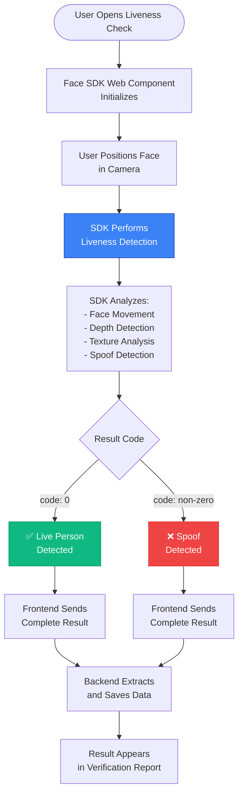

### Architecture

```mermaid
graph TB
    subgraph Browser["🌐 Browser"]
        SDK[Face SDK Web Component<br/>- Captures video from webcam<br/>- Analyzes face movement, depth<br/>- Returns: {code, transactionId, ...}]
    end
    
    subgraph Backend["🔧 Backend (NestJS)"]
        API[POST /api/face/liveness]
        Process[Process Liveness Result<br/>- Maps code: 0→genuine<br/>- Maps non-0→spoof<br/>- Saves to database]
    end
    
    SDK -->|HTTP| API
    API --> Process
    Process --> DB[(Database<br/>face_results)]
    
    style Browser fill:#3b82f6,stroke:#1e40af,color:#fff
    style Backend fill:#10b981,stroke:#059669,color:#fff
```

### Detailed Sequence Flow

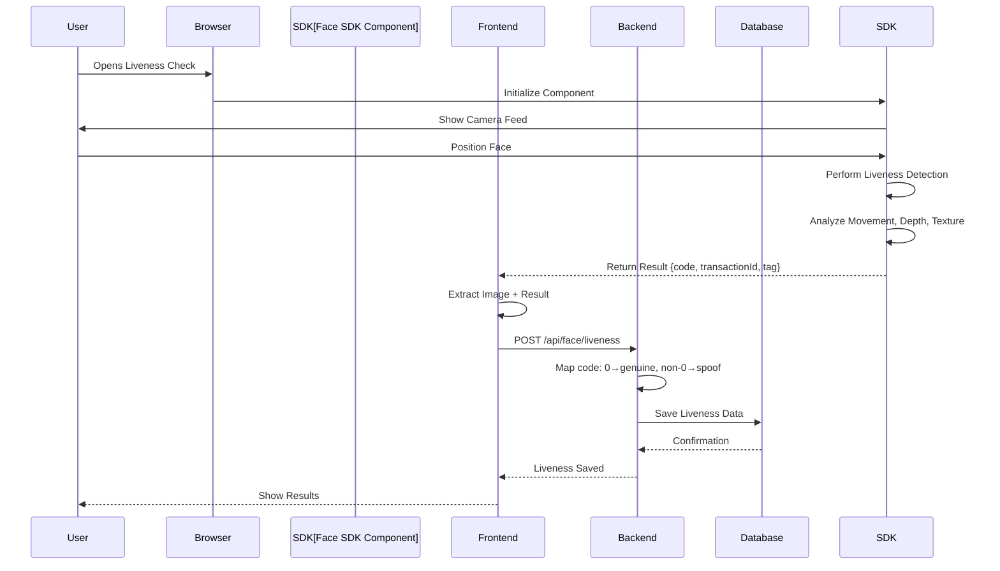

### Status Codes

The Regula Face SDK uses the **`code` field** to indicate liveness results:

| Code | Meaning | Status | Verification |
|------|---------|--------|--------------|
| `0` | Live person detected | ✅ `genuine` | PASS |
| `247` | Spoof detected | ❌ `spoof` | FAIL |
| Other non-zero | Error/Poor quality | ❌ `spoof` | FAIL |

### Response Format

**Successful Liveness (code: 0):**
```json
{
  "code": 0,
  "transactionId": "a9b418a8-5191-4ba9-a2fe...",
  "tag": "d7001412-0555-4660-89ee...",
  "status": 0,
  "estimatedAge": 28,
  "livenessType": "active",
  "metadata": {
    "elapsedTime": 3.5,
    "serverTime": "2025-11-22T10:30:00Z"
  }
}
```

**Failed Liveness (code: 247):**
```json
{
  "code": 247,
  "transactionId": "281a424b-163e-4e37-af61...",
  "tag": "3ab5ffea-0609-42c5-9dc9...",
  "status": 1,
  "metadata": { ... }
}
```

### Database Storage

All liveness data is saved to the `face_results` table:

```sql
liveness_status          -- 'genuine', 'spoof', or 'unknown'
liveness_score           -- Numeric score (0-1)
liveness_confidence      -- Confidence level (0-1)
liveness_code            -- Result code (0 = success)
liveness_transaction_id  -- Unique transaction ID
liveness_tag             -- Session tag
liveness_type            -- Detection type (active/passive)
liveness_estimated_age  -- Estimated age
liveness_metadata        -- Full metadata (JSONB)
liveness_images          -- Captured frames (JSONB)
raw_liveness_response    -- Complete SDK response (JSONB)
```

---

## Liveness-First Verification

### Overview

A verification scenario that optimizes the flow by performing liveness detection first, then using the captured liveness image as the portrait for document verification. This eliminates the need for a separate face matching step.

### Flow Comparison

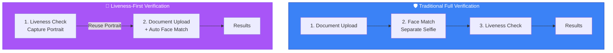

### Detailed Sequence Flow

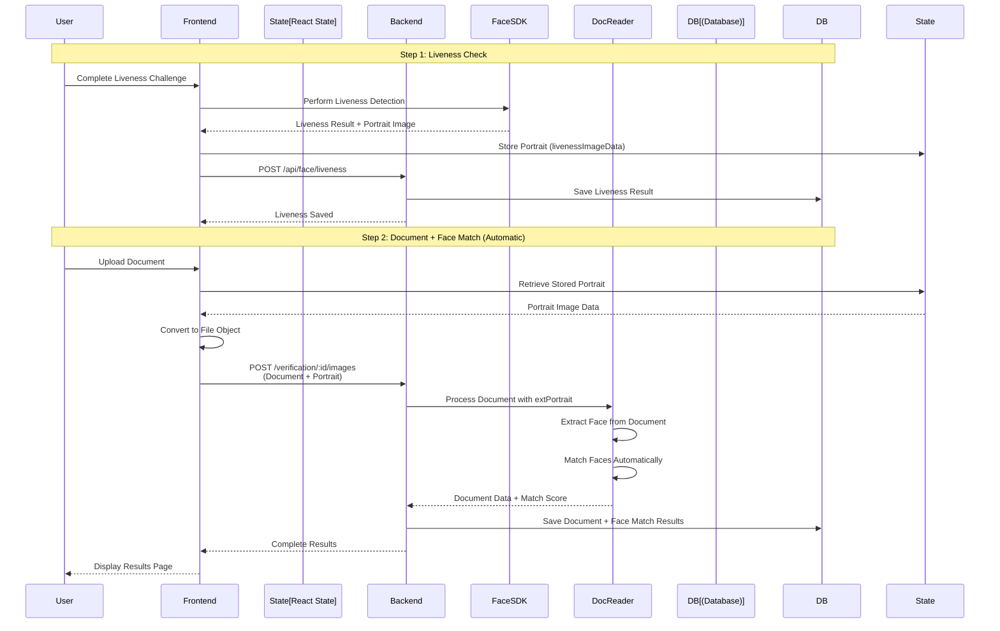

### Benefits

1. **Efficiency** - Reduces steps from 3 to 2
2. **Better UX** - Users don't need to take multiple selfies
3. **Higher Security** - Portrait is guaranteed from live person
4. **Same Backend** - No backend changes needed

### Implementation

**Frontend State Management:**
```typescript
const [livenessImageData, setLivenessImageData] = useState<string | null>(null);

const handleLivenessCapture = (imageData: string, livenessResult?: any) => {
  if (isLivenessFirst) {
    setLivenessImageData(imageData); // Store for document upload
    setFacePreview(imageData);
  }
  livenessMutation.mutate({ imageData, livenessResult });
};
```

**Document Upload with Portrait:**
```typescript
if (isLivenessFirst && livenessImageData) {
  const livenessBlob = await fetch(livenessImageData).then(res => res.blob());
  const livenessFile = new File([livenessBlob], 'liveness-portrait.jpg');
  
  formData.append('images', documentFile);     // Index 0
  formData.append('images', livenessFile);      // Index 1
  formData.append('documentIndex', '0');
  formData.append('faceIndex', '1');
}
```

---

## Understanding Spoof Detection

### Why "Spoof" is Detected

**This is NOT a bug!** The Face SDK is designed to **protect against fraud**. If it detects "spoof", it means the liveness check correctly identified that the face is not from a live person.

### Liveness Detection Flow

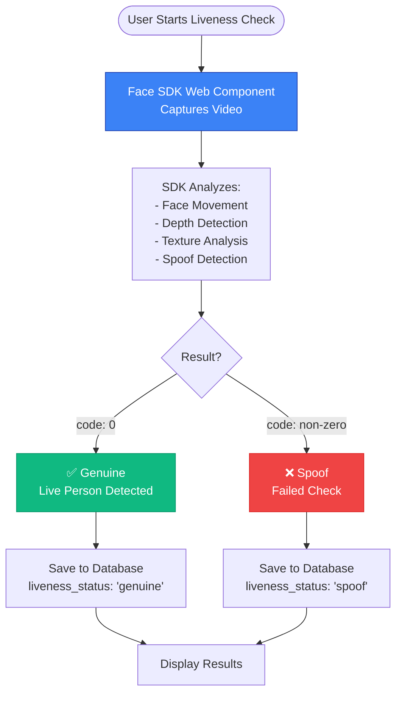

### Common Failure Scenarios

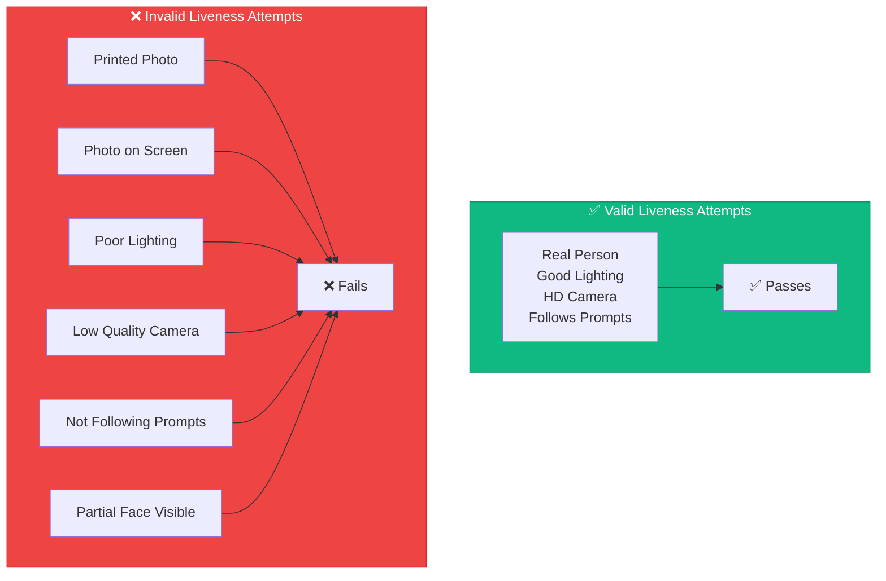

### Common Causes

1. **Testing with Photos**
   - ❌ Holding up a printed photo
   - ❌ Showing a photo on another screen/phone
   - ✅ Use a real person in front of the camera

2. **Screen/Monitor Detection**
   - ❌ The SDK can detect if you're showing another screen
   - ✅ Use the actual webcam with a live person

3. **Poor Lighting**
   - ❌ Too dark, too bright, or uneven lighting
   - ✅ Well-lit room with natural or good artificial light

4. **Not Following Prompts**
   - ❌ Not moving head when prompted
   - ❌ Not looking at camera
   - ✅ Follow ALL on-screen instructions

5. **Low Camera Quality**
   - ❌ Very low resolution or poor quality webcam
   - ✅ Use HD webcam (720p or better)

6. **Partial Face Visible**
   - ❌ Face too close, too far, or partially obscured
   - ✅ Full face clearly visible in frame

### How to Pass Liveness Check

✅ **Best Practices:**

1. **Use Real Person**
   - Sit in front of camera
   - Well-lit environment
   - No glasses/hats if possible

2. **Follow Instructions**
   - Look at camera
   - Move head as prompted
   - Complete all challenges

3. **Camera Setup**
   - HD webcam (720p+)
   - Stable mounting
   - Good lighting (not backlit)

4. **Face Position**
   - Full face visible
   - Center of frame
   - Not too close/far

5. **Environment**
   - Solid background
   - No mirrors/reflections
   - Quiet (for attention)

### Security Note

⚠️ **This is a SECURITY FEATURE!**

The Face SDK is designed to prevent:
- Photo attacks (printed photos)
- Video replay attacks (recorded videos)
- Screen capture attacks (showing another device)
- Mask attacks (3D masks)
- Deep fake attacks

If it says "spoof", it's **protecting you** from fraudulent verification attempts!

---

## Architecture Decisions

### Liveness Data Handling Architecture

**Decision:** Adopt Frontend-to-Backend Direct Data Transfer Architecture

The application uses **Web Component Mode** where:
1. Frontend Face SDK Web Component performs liveness detection
2. SDK returns immediate result: `{ transactionId, status, tag }`
3. Frontend sends complete result to backend via `/api/face/liveness`
4. Backend saves data directly without fetching from Face SDK
5. Backend extracts and stores liveness information in database

### Data Flow Architecture

```mermaid
graph TB
    subgraph Browser["🌐 User's Browser"]
        SDK[Face SDK Web Component<br/>Regula JavaScript SDK<br/>- Captures video from webcam<br/>- Performs liveness detection<br/>- Analyzes face movement, depth, texture<br/>- Returns result immediately]
    end
    
    subgraph Backend["🔧 Backend Server"]
        Service[Face Service<br/>face.service.ts<br/>- Receives: sessionId, livenessResult<br/>- Maps status: 0→genuine, 1→spoof<br/>- Extracts: transactionId, tag, status<br/>- Saves to database]
        DB[(PostgreSQL Database<br/>face_results table)]
    end
    
    subgraph FaceSDKServer["🔌 Face SDK Server"]
        API[Face SDK API<br/>regula-face:8081<br/>- /api/ping health check<br/>- /api/match face comparison<br/>- ❌ /api/v2/liveness NOT available<br/>Web Component Mode]
    end
    
    SDK -->|POST /api/face/liveness<br/>{transactionId, status, tag}| Service
    Service -->|Save| DB
    SDK -.->|Uses for detection| API
    
    style Browser fill:#3b82f6,stroke:#1e40af,color:#fff
    style Backend fill:#10b981,stroke:#059669,color:#fff
    style FaceSDKServer fill:#f59e0b,stroke:#d97706,color:#fff
```

### Architecture Comparison

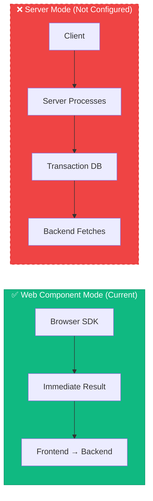

### Why This Architecture?

**Positive:**
- ✅ Simpler Architecture - No dependency on Face SDK transaction storage
- ✅ Faster Response - Immediate data capture, no additional API calls
- ✅ Lower Latency - Eliminates backend→Face SDK round-trip
- ✅ Fewer Failure Points - No risk of Face SDK API being unavailable
- ✅ Cost Effective - Uses standard Web Component mode
- ✅ Scalable - No server-side transaction database needed

**Limitations:**
- ⚠️ Limited Data - Only receives minimal data from Web Component
- ⚠️ Trust Frontend - Must trust frontend SDK results (mitigated by transactionId)
- ⚠️ Manual Verification - Cannot fetch historical liveness data from API

### Status Code Mapping

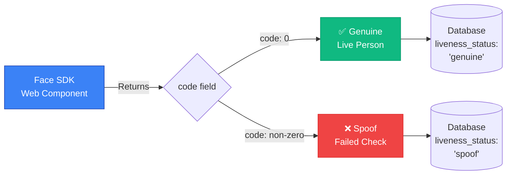

| SDK Status | Meaning | Database Value | Verification |
|-----------|---------|----------------|--------------|
| `0` | Genuine (Live person) | `"genuine"` | ✅ PASS |
| `1` or non-zero | Spoof (Photo/Video/Mask) | `"spoof"` | ❌ FAIL |

---

## Troubleshooting

### Component Not Initializing

**Issue:** Component shows loading spinner indefinitely

**Solutions:**
1. Check browser console for errors
2. Verify backend services are running:
   ```bash
   docker ps | grep regula
   ```
3. Check network tab for API calls
4. Verify CORS settings in backend

### Camera Permission Denied

**Issue:** User denies camera access

**Solution:**
- Component will show error
- Guide user to enable camera in browser settings
- Fallback to file upload

### Liveness Check Always Shows "Spoof"

**Common Causes:**
1. Testing with photos instead of real person
2. Poor lighting conditions
3. Not following liveness prompts
4. Low camera quality
5. Face not properly visible

**Solutions:**
- Use real person with quality webcam
- Ensure good lighting
- Follow all on-screen instructions
- Remove glasses/hats if possible
- Position face properly in frame

### Face SDK Won't Start

**Check logs:**
```bash
docker logs kyc-facesdk --tail 50
```

**Common issues:**

1. **License not found:**
   ```bash
   ls -la regula-licenses/facesdk.license
   ```

2. **Port conflict:**
   ```bash
   netstat -ano | findstr :8081
   ```

3. **Binary path wrong:**
   - Check `docker/facesdk/Dockerfile` CMD line
   - May need to find actual path:
     ```bash
     docker run -it --rm kyc-facesdk:local find / -name "*face*" -type f 2>/dev/null
     ```

### Backend Connection Issues

**Issue:** "Failed to connect to backend"

**Solutions:**
1. Verify backend is running:
   ```bash
   curl http://127.0.0.1:4000/api/verification
   ```

2. Check environment variables:
   ```bash
   docker exec kyc-frontend env | grep VITE
   ```

3. Verify CORS settings:
   ```typescript
   // backend/src/main.ts
   app.enableCors({
     origin: ['http://127.0.0.1:3000', 'http://localhost:3000'],
     credentials: true,
   });
   ```

### Download Issues

**Script won't run:**
```bash
# Make sure Git Bash or WSL is installed
# Try: wsl bash download-facesdk.sh
```

**Download too slow:**
- Select an older, smaller version (e.g., version 6.4 is 960MB vs 1.1GB)
- The script lets you choose the version

**Download interrupted:**
- Just run the script again
- It will restart from beginning

---

## API Reference

### Frontend API Functions

#### Verification APIs

```typescript
// Create session
createVerificationSession(userIdentifier?: string): Promise<VerificationSession>

// Get session
getVerificationSession(sessionId: string): Promise<VerificationSession>

// Get report
getVerificationReport(sessionId: string): Promise<VerificationReport>
```

#### Document APIs

```typescript
// Process document
processDocument(sessionId: string, file: File): Promise<DocumentProcessResponse>

// Get document result
getDocumentResult(sessionId: string): Promise<DocumentResult>
```

#### Face APIs

```typescript
// Check liveness (with base64)
checkLivenessFromBase64(
  sessionId: string,
  imageBase64: string,
  livenessResult?: any
): Promise<LivenessCheckResponse>

// Match faces (with base64)
matchFacesWithBase64(
  sessionId: string,
  base64Image: string
): Promise<FaceMatchResponse>

// Upload verification images (document + portrait)
uploadVerificationImages(
  sessionId: string,
  documentFile: File,
  faceFile: File
): Promise<any>
```

### Backend API Endpoints

#### Face Endpoints

**POST** `/api/face/liveness`
- Check face liveness
- Accepts: `sessionId`, `imageBase64`, `livenessResult`
- Returns: Liveness result with status

**POST** `/api/face/match`
- Match selfie with document face
- Accepts: `sessionId`, `imageBase64` or `files[]`
- Returns: Match result with score

**GET** `/api/face/:sessionId`
- Get face result by session ID
- Returns: Complete face result

#### Document Endpoints

**POST** `/api/document/process`
- Process document with Regula
- Accepts: `file`, `sessionId`
- Returns: Document result

**GET** `/api/document/:sessionId`
- Get document result by session ID
- Returns: Complete document result

#### Verification Endpoints

**POST** `/api/verification/:id/images`
- Upload images for verification
- Accepts: `images[]`, `documentIndex`, `faceIndex`
- Returns: Document and face match results

---

## User Experience Flows

### Document Capture Flow

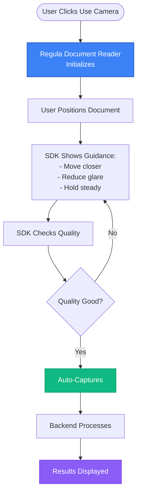

### Face Capture with Liveness Flow

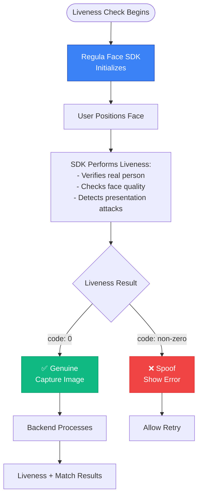

---

## Configuration Files

### Face SDK Configuration (`docker/facesdk/config.yml`)

```yaml
license:
  url: file:///app/facesdk.license

storage:
  endpoint: http://storage:9000
  bucket: face-liveness

database:
  host: postgres
  name: kyc_demo

processing:
  workers: 2
  timeout: 30

liveness:
  enabled: true
```

### Environment Variables

**Backend (.env):**
```env
REGULA_DOC_READER_URL=http://regula-docreader:8080
REGULA_FACE_SDK_URL=http://regula-face:8081
```

**Frontend (.env):**
```env
VITE_API_URL=http://localhost:4000
```

---

## Testing

### Test Document Capture

1. Open http://localhost:3000
2. Start verification
3. Click "Use Camera" for document
4. Position document in frame
5. SDK will auto-capture when quality is good
6. View extraction results

### Test Face Capture with Liveness

1. Open http://localhost:3000
2. Start verification
3. Complete liveness check step
4. Follow on-screen guidance
5. SDK will verify liveness during capture
6. View liveness results

### Test Liveness-First Flow

1. Select "Liveness-First Verification" scenario
2. Complete liveness check (captures portrait)
3. Upload document (portrait automatically used)
4. View complete results with all checks

---

## Additional Resources

### Regula Documentation

- [Face SDK Web Components](https://docs.regulaforensics.com/develop/face-sdk/web-components/)
- [Document Reader Web Components](https://docs.regulaforensics.com/develop/document-reader-sdk/web-components/)
- [Face SDK Web Service](https://docs.regulaforensics.com/develop/face-sdk/web-service/)
- [Document Reader Web Service](https://docs.regulaforensics.com/develop/document-reader-sdk/web-service/)

### Project Documentation

- [Backend API Documentation](./BACKEND_API_DOCUMENTATION.md) - Complete backend API reference
- [Frontend Documentation](./FRONTEND_DOCUMENTATION.md) - Frontend architecture and components
- [Verification Scenarios](./VERIFICATION_SCENARIOS_COMPARISON.md) - All verification flows
- [TROUBLESHOOTING.md](./TROUBLESHOOTING.md) - General troubleshooting guide

### Legacy Documentation (Consolidated into this guide)

The following files have been consolidated into this complete guide:
- `REGULA_SDK_INTEGRATION.md` - General SDK integration (now in sections 1-4)
- `FACE_SDK_SETUP.md` - Face SDK setup (now in section 3)
- `LIVENESS_GUIDE.md` - Liveness detection (now in section 5)
- `LIVENESS_FIRST_VERIFICATION.md` - Liveness-first flow (now in section 6)
- `LIVENESS_SPOOF_DETECTION.md` - Spoof detection (now in section 7)
- `ARCHITECTURE_DECISION_LIVENESS.md` - Architecture decisions (now in section 8)

### Project Files

- `frontend/src/components/CyantechDocumentCapture.tsx` - Document capture component
- `frontend/src/components/CyantechFaceCapture.tsx` - Face capture with liveness
- `frontend/src/pages/VerificationFlow.tsx` - Main verification flow
- `backend/src/modules/face/face.service.ts` - Face processing service
- `backend/src/modules/document/document.service.ts` - Document processing service

---

## Summary

✅ **Complete SDK Integration** - Both Document Reader and Face SDK fully integrated  
✅ **Built-in Liveness** - No separate liveness step needed  
✅ **Professional UI** - Regula Web Components provide polished experience  
✅ **Production Ready** - Battle-tested, maintained by Regula  
✅ **Comprehensive Documentation** - All setup, usage, and troubleshooting covered  

**Status:** ✅ Fully integrated and ready to use!

---

**Last Updated:** November 22, 2025  
**Version:** 1.0  
**Status:** ✅ Production Ready

